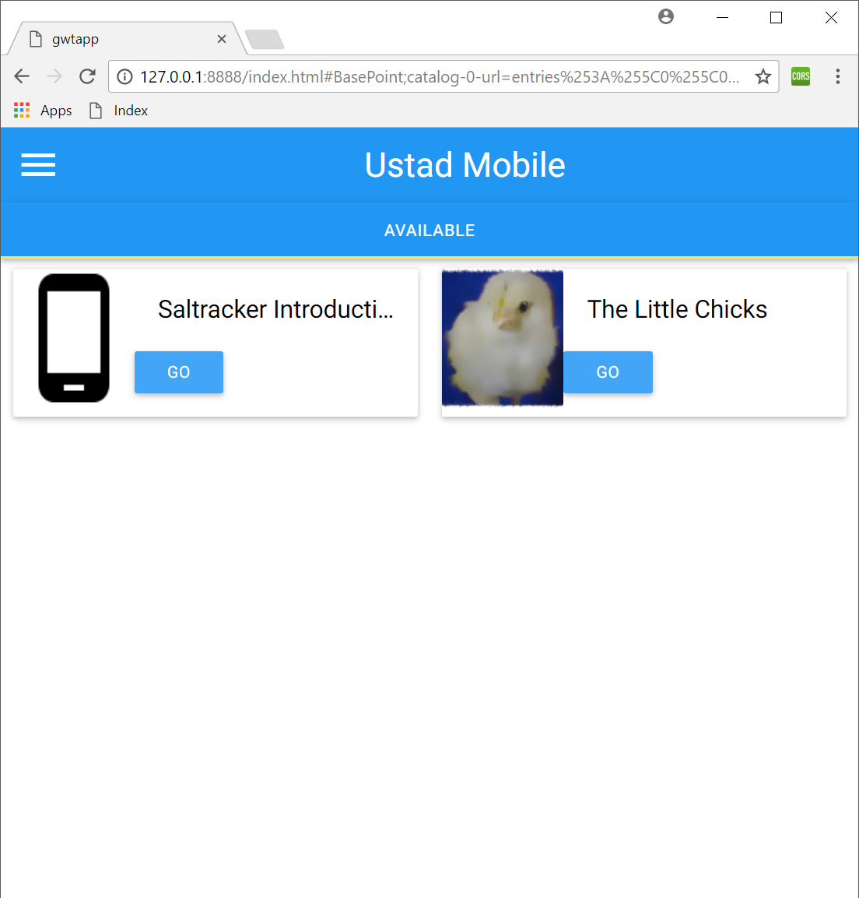
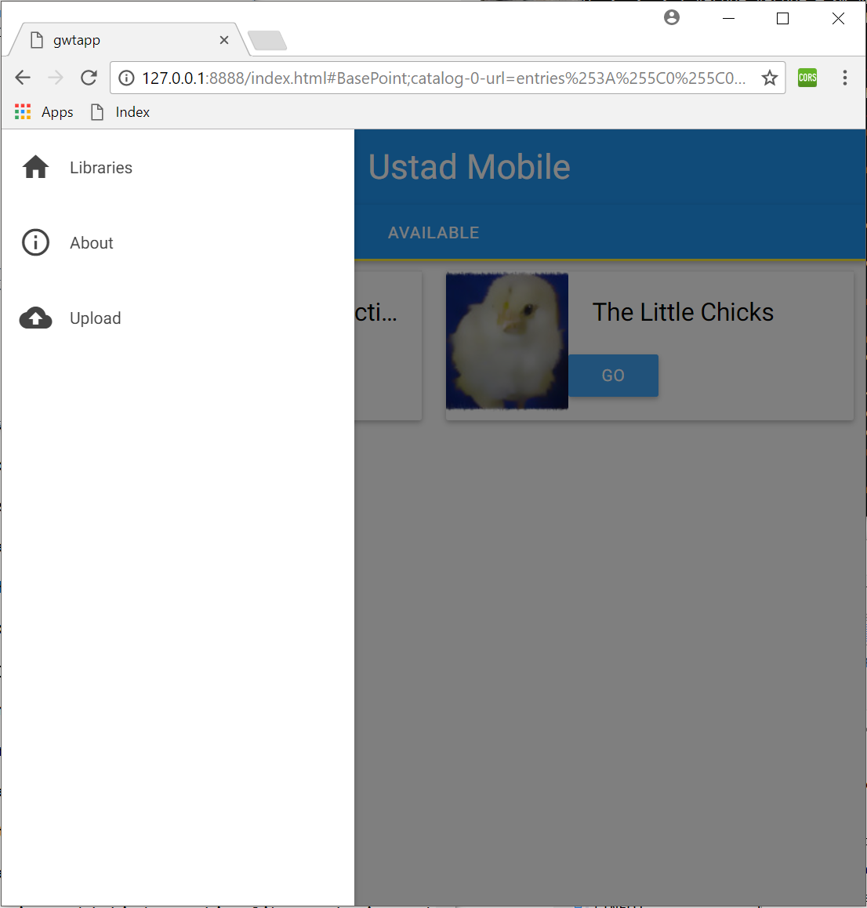
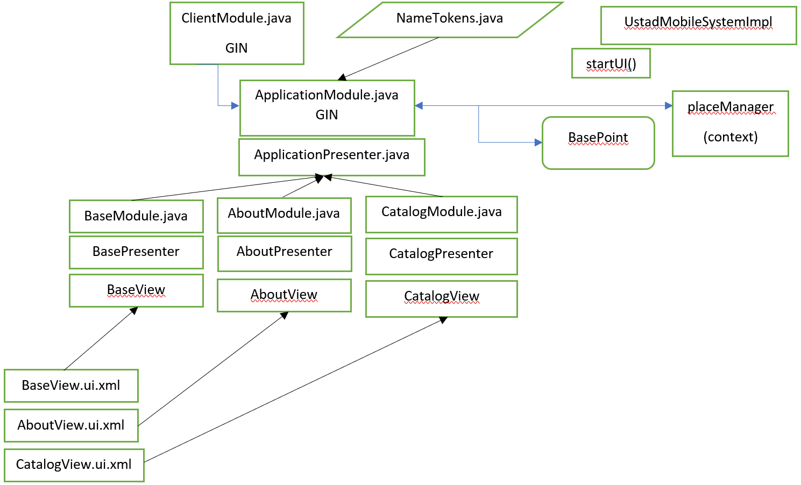

## UstadMobile GWT project

This branch : gwtdev2 is the GWT branch of UstadMobile application. Here resides all GWT components - code and assets for the project. 

#### Why GWT?
GWT is Google's Web Toolkit. It allows us to use the same underlining java code used on android/j2me on the web. This project allows to get an app like experience on the web. eg: login, browse opds, view content, access statistical data (if your role allows it), etc. In addition functions that typically start on the web such as user and group management can be made available to all modern platforms of UstadMobile under one core code base. 
GWT would still need to have its own views, system implementation of some platform specific tasks such as xml parsing, HTTP request, replacement for files, etc. 
GWT would also need to be visually scalable within different device types.

We've choosen to use this structure for UstadMobile GWT:
GWTP uiBinders for Views and GWT-Material for style and consistency with Material Design layouts on Android.

#### Screenshots of the application and progress:



#### Project folder:
All GWT related code and assets live in the app-gwt folder. This is also the folder for the eclipse project. Since GWTP uses Maven, app-gwt is also a maven project and can be built frm the command line. 

#### Building:
Git clone and checkout gwtdev2 branch. 
```console
git checkout gwtdev2
```
Then go to app-gwt folder
```console
cd app-gwt
```
Run buildcore.sh <- This script copies core files to the project. It also copies lib db, annotations and utils. It also removes any classes that cannot be replaced by the GWTp build procedure. 
```console
./buildcore.sh
```

For an IDE independent build procedure:
On a console where maven is present, first clean (just in case) and then install :
```console
maven clean
maven install
```
In order to run the project we need to launch eclipse and set it up. 
Make sure you have GWT plugin for Ecipse installed. 
Import existing project to eclipse and choose the folder app-gwt
Add a new run configuration in eclipse - this will be the config that runs the gwt application.

	Goals: gwt:run
	Base directory : Choose the project imported when you click Workspace..
	Give it a recognizable name. eg: app-gwt GWT Run

If you didnt do the command line tools, you can right click the project and select : Run As > Maven clean.. and then Run As > Maven install..
Then click the Run icon dropdown and select app-gwt GWT Run to run the application. This will open a Jetty instance after successful build and compilation. You can tell launch the application and see where it is at now in development. 

#### Getting Started with GWTP and GWT-Material ####

This explains how we got to this project. The documentation on both of them took a while getting used to- so here are my notes in setting up a project like this. 

We first use GWT-Material's documentation and build the archetype: 

```mvn archetype:generate -DarchetypeGroupId=com.github.gwtmaterialdesign -DarchetypeArtifactId=gwt-material-archetype -DarchetypeVersion=2.0```

On Windows, ```archetypeVersion=2.1``` does not work and complains about some missing bits. Setting that to version 2.0 seems okay as of today (July 2018). After this, enter in the necessary artifact and group Ids. Here is an example to understand how it could be:

```
Define value for property 'groupId': com.varuna.port.gwt
[INFO] Using property: groupId = com.varuna.port.gwt
Define value for property 'artifactId': gwtbasicapp
[INFO] Using property: artifactId = gwtbasicapp
[INFO] Using property: version = 1.0-SNAPSHOT
Define value for property 'package' com.varuna.port.gwt.gwtbasicapp: :
```

Note: Make sure that your artifactId does not have any hyphens "-" that will mess up the way the sources are set in the Eclipse project. While you can solve this, it would be easier to just have one continuous string as the artifactId instead. 

This will create a folder ```gwtbasicapp``` which is the project that can be opened in Eclipse (what I'm using - however can be opened in IntelliJ as well). 

Note: Eclipse and GWT needs the GWT plugin to work best together. 

The XMLS auto-generated might be throwing a warning. To solve that, we need to replace the ```DOCTYPE``` url in the XML's header with the new URL. 

From this:

```
<!DOCTYPE module PUBLIC "-//Google Inc.//DTD Google Web Toolkit 2.7.0//EN"
        "http://gwtproject.org/doctype/2.7.0/gwt-module.dtd">
```

to this:

```
<!DOCTYPE module PUBLIC "-//Google Inc.//DTD Google Web Toolkit 2.7.0//EN"
        "http://www.gwtproject.org/doctype/2.8.0/gwt-module.dtd">
```

Then the whole project in the IDE does not complain. 

Regarding testing, we need to set it up such that maven runs our tests separately.  This is explained in the Testing section of this document. 

#### Linking additional sources on GWT + GWTP + Maven ####

Our project has a mix of implementations, core, replacement sources and libraries that are all sources to the GWT project. They all need to be compiled on client and this is how we are doing it. 

If you want to link external source's jar files (that do NOT have ```*.java``` files) in maven, we need to add the ```compileSourcesArtifacts``` tag to the ```configuration``` tag of ```gwt-maven-plugin``` plugin. 

```
<plugin>
	<artifactId>gwt-maven-plugin</artifactId>
	...
	<configuration>
		...
        <compileSourcesArtifacts>
            <compileSourcesArtifact>com.something.proj:Name</compileSourcesArtifact>
        </compileSourcesArtifacts>
	...
	
```

For step by step procedure, check out the section: Adding an external class/package to the GWT client. 


#### Project Structure ####
For clarity and sanity, here is how the project is structured right now.

```console
repo/app-gwt/	<- This is where all the GWT bit lives. 
├─ core-src/	<- Contains core source/assets/res copied via build .sh
│  ├─ main/ 
│  │  ├─ ...
├─ images/	<- Contains images for this MD & any other doc/wiki
│
├─ lib-database-annotation-src/
├─ lib-database-src/
├─ lib-util-src/
│
├─ src/		<- The main GWT specific source folder 
│  ├─ main/
│  │  ├─ assets/
│  │  │	 ├─ com/ustadmobile/core 
│  │  │		├─ <Files>	<- Contains feeds, html, prop  files for core
│
│  │  ├─ java/
│  │  │	 ├─ com/ustadmobile/
│  │  │	 │  ├─ core/
│  │  │	 │  │  ├─ db/		<- DB Manager Factory returns GWT impl
│  │  │	 │  │  ├─ impl/		<- SystemImpl Factory return GWT impl
│  │  │	 │  │  ├─ opds/		<- OPDS Async Helper 
│  │  │	 │  │  ├─ util/		<- Utilities eg UMCalendar impl
│  │  │	 │  │  ├─ about.html <- About file here for now.
│  │  │	 │  ├─ port/gwt/
│  │  │	 │  │  ├─ client/ 	<- This package has GWT/GWTP MVP specific code
│  │  │	 │  │  │  ├─ application/ <- Consists of the application and every single Views, Modules, Presenters, Gatekeepers.
│  │  │	 │  │  │  ├─ db/	<- DAO's, GWT impl of DB Manager, DAOs, OpdsEntryRepository, etc
│  │  │	 │  │  │  ├─ gin/	<- Contains MAIN module. It is from this main module where all child modules. (used by GWTP)
│  │  │	 │  │  │  ├─ impl/	<- GWT impl of SystemImpl, Logging, HttpResponse.
│  │  │	 │  │  │  ├─ place/	<- Consists NamesTokens that identifies all Places available as String urls.
│  │  │	 │  │  │  ├─ resources/	<- Contains AppResources class
│  │  │	 │  │  │  ├─ test/		<- Test files go here
│  │  │	 │  │  │  ├─ util/		<- GWT specific util files go here
│  │  │	 │  │  ├─ xmlpull/	<- XmlPullParser GWT implementation
│  │  │	 │  │  │  ├─ XmlPullParserGWT.jav	<- GWT implementation of XPP.
│
│  │  ├─ res/		<- Any resources used by GWT are copied here
│
│  │  ├─ resources	<- Any resources used by GWT packages
│  │  │	 ├─ com/ustadmobile/port/
│  │  │		├─ gwt/
│  │  │		│  ├─ client/
│  │  │		│     ├─ gwtapp.gwt.xml <- Main GWT App's XML
│  │  │		├─ Core.gwt.xml	<- Core module's gwt xml
│  │  │		├─ Lib.gwt.xml 	<- Lib modules's gwt xml
│
│  │  ├─ webapp/	<- Contains Website assets(feeds, images, etc) copied from source package
│  │  │	 ├─ com/ustadmobile/core/
│  │  │	 │  ├─ <Files> <- Copied from src/main/assets/com/ustadmobile/core to be accessible.
│  │  │	 ├─ WEB-INF/
│  │  │	 │  ├─ com/ustadmobile/core/
│  │  │	 │  │  ├─ <Files> <-Copied from src/main/assets/com/ustadmobile/core to be accessible.    
│  │  │	 ├─ index.html	<- If you want this to load; other static html files. 
│  
├─ src-jre/	<- Class override -To implement JRE classes that are not in GWT 
│  ├─ main/java/java/util/concurrent/atomic/AtomicInteger.java 	<- Implemented as normal int. 
│ 
├─ src-json/ <- Class overide to implement JSON class's methods not in GWT
│  ├─ main/java/org/json/ 
│  │  ├─ <Classes>
│ 
├─ src-xpp/ <- Classes override to implement XPP classes and its methods not in GWT
│  ├─ main/java/org/xmlpull/v1/
│  │  ├─ <Classes>
│  
├─ target/	<- Build directory for maven
│  ├─ <Files>
│ 
├─ buildcore.sh	<- The build script. This copies files and renames, etc for GWT to work. Check README for the right setup steps.
├─ pom.xml	<- The project's maven pom xml. 
├─ README.md 	<- This md README
```

#### GWT application explanation ####
All GWT specific source files are in ```src``` folder. All classes are in the ```java``` folder. 
The ```com.ustadmobile.core``` package has factory classes that return GWT implementation bits. 
The ```com.ustadmobile.port.gwt``` package has all GWT related source code. 
The ```com.ustadmobile.port.client``` package has all GWT client classes to make the application run.
The packages and classes outside ```client``` are related to GWT but are not part of running GWT and its components. 

#### Application components ####
Note: This project is using GWTP and GWT-Material (for UI). For more understanding, refer to their turorial: https://dev.arcbees.com/gwtp/tutorials/index.html

All the application components lie in the package ```com.ustadmobile.port.gwt.client.application```. Every page/view has a module associated with it that is declared and linked by the class: ApplicationModule.java. This "installs" the module to the application. 

```
configure(){
	...
	install(new AboutModule());
	...
}
```

Every page/view is in its own package. eg: ```com.ustadmobile.port.gwt.client.application.about```. The package contains of the GWT Presenter, UI Handler, GWT View and GWT Module. 

```
├─ com.ustadmobile.port.gwt.client.application
│  ├─ ...
│  ├─ about/
│  │  ├─ AboutModule.java
│  │  ├─ AboutPresenter.java
│  │  ├─ AboutUiHandlers.java
│  │  ├─ AboutView.java
│  ├─ ApplicationModule.java
│  ├─ ApplicationPresenter.java
│  ├─ ApplicationView.java
```

##### Module #####
All modules declared in the ApplicationModule.java class' configure() are sub-modules to it. A Module here is a GIN module. A GIN module, made by Google, is used by GWTP for dependency injection. A GIN Module should extend ```AbstractPresenterModule``` in any GWTP application. 

In all modules and sub-modules you bind the presenter, view to the module using bindPresenter(). For eg: in AboutModule we bind the AboutPresenter and in the main ApplicationModule we bind the ApplicationPresenter class. 

The starting point of this GWT application is from ApplicationModule. Like its sub modules and view, it has a presenter and a view: ApplicationView. 

##### Presenter #####
But we are only declaring the panel in the parent and no content yet. We aren't telling GWT to go to any particular page because we are internally handling that in UstadMobileSystemImpl.startUI(). This is similar across all ports of UstadMobile. So we are declaring an instance of UstadMobileSystemImpl in the main ApplicationPresenter and calling startUI(). 

The main ApplicationPresenter class has the logic for everything to do with GWT application start. For now it has some methods to go to different pages of the application and most importantly initiates UstadMobileSystemImpl. 

The presenters for the individual views in their packages are child Presenters here. For eg: AboutPresenter is the child presenter of Application Presenter. It uses its parent presenter (ApplicationPresenter)'s slot to reveal itself. 

 ###### What does a GWT Presenter do ? ######

 The way to link a Core Presenter to this GWT Presenter is to create a new CorePresenterHandler class (inside the GWT Presenter) that extends the Core Presenter and implements any UiHandlers. In this nested class's constructor we call super with the context and view passed to it. 

``` 
 public class CoreAboutPresenterHandler 
 	extends com.ustadmobile.core.controller.AboutController	
		implements UiHandlers {
			public CoreAboutPresenterHandler(Object context, AboutView view) {
				super(context, view);
				// TODO Auto-generated constructor stub
				GWT.log("CoreAboutPresenter constructor. TODO.");
		}
 } 
```

 This CorePresenterHandler is used to create a ```mController``` object within the GWT Presenter. 

 ```mController = new CorePresenterHandler(placeManager, (AboutView)view); ```

 This Core presenter (or mController) can be used elsewhere throughout the presenter. We choose to use the placeManager as the context that will get passed around as state. Place managers work as an intermediary between the GWT History API and ProxyPlaceAbstract. It sets up event listener relationships to synchronize them.

The view object is an interface created in the Application Presenter. Every Presenter has two interfaces - MyView and MyProxy. MyView extends GWTP View,  extend any other View and in our case extends our core View.

```
    //About Presenter's View Interface
    interface MyView extends 
    	View, 
		HasUiHandlers<CoreAboutPresenterHandler>, 
		com.ustadmobile.core.view.AboutView {
    }
```

So with that laid out, we have a way to create a new page, load it to the application. Bind its presenter and view. Link Core Presenter with the GWT Presenter and link Core View to GWT View as well. 

Any update to the Core View will update the GWT View. 

##### View #####
A View in GWT is bound to a corresponding view_name.ui.xml file in the same package. A UI XML contains the widgets and we use GWT-Material panels and normal HTML Panels. Below is a simple UI XML.

```
<ui:UiBinder xmlns:ui='urn:ui:com.google.gwt.uibinder'
             xmlns:g='urn:import:com.google.gwt.user.client.ui'>    
    <g:HTMLPanel>
    	<p>Hello AboutView!</p>
        <g:TextBox ui:field="textBox"/><br/>
        <g:TextArea ui:field="version"/><br/>
        <g:Button ui:field="updateText" text="Update Text"/>
    </g:HTMLPanel>
    
</ui:UiBinder>
```

This is bound by this line of code in AboutView.java:

```
//This is how GWTP knows to use the HomeView.ui.xml file (bind it)
interface Binder extends UiBinder<Widget, AboutView> {
}
```

A GWT-Material panel can be used like so (in ApplicationView.ui.xml):

```
<m:MaterialPanel ui:field="content">
  <m:MaterialLabel>Content Material Label</m:MaterialLabel>
</m:MaterialPanel>
```

Since we want to separate  out classes and ui xmls, they are located in the resources package of src folder. 

```
├─ src/main/resources/com/ustadmobile/port/gwt/client/application
│  ├─ ...
│  ├─ about/
│  │  ├─ AboutView.ui.xml
│  ├─ ApplicationView.ui.xml
```

Since the starting point of this GWT application is ApplicationModule, we can see ApplicationView has a panel content declared (in this case it is a material panel since we are using GWT-Material for UI).

We are also injecting in the view's constructor the content panel in the ApplicationPresenter's slot.

The concept of slots is how UIs are generated. We can have side slot, content slot, etc. Our current design is separating out content in its own panel and the side menu in a different slot. 

Our GWT Views extend the MyView interfaces (that in turn extend from CorePresenterHandler) so every methods of Core View's are overridden. If a Core presenter is updating a core view's text field for example, it will update GWT Views and so on. 

##### Other parts of GWTP #####
There are other integral part of this project that are so that this GWTP application can run okay.

```
├─ com.ustadmobile.port.gwt.client
│  ├─ ...
│  ├─ gin/
│  │  ├─ ClientModule.java
│  ├─ place/
│  │  ├─ NameTokens.java
│  ├─ resources/
│  │  ├─ AppResources.java
│  │  ├─ ResourceLoader.java
```

###### NameTokens.java ######
This is a simple class that mapps literal String names to places. 

```
public class NameTokens {
	...
    public static final String ABOUT = AboutView.VIEW_NAME;
    ...
}
```

###### ClientModule.java ######
This is your main GIN module from which all of the child modules are loaded. It is also where the DefaultPlaceManager is setup. In GWTP, this is the very start of the application. 

##### GWTP and pom.xml #####
The pom.xml file is important in setting up our GWTP application. Below are the few components that showcases the application properties, its components, how GWT accepts sources and resources, other dependencies, version control and other things. 

Application properties, Version info are defined within the properties tag like so: 

```
    <!-- App -->
    <app.id>ustadmobile-gwtp</app.id>
  	<app.version>1</app.version>
```

Project properties are defined in the root of the xml:

```
    <groupId>com.ustadmobile.port.gwt</groupId>
    <artifactId>ustadmobile-gwtp</artifactId>
    <version>1.0-SNAPSHOT</version>
```

The build output as per maven defaults is : 
```<webappDirectory>${project.build.directory}/${project.build.finalName}</webappDirectory>```
Where ```project.build.finalName``` resolves to : ${artifactId}-${version} which in our case is: ```target/ustadmobile-gwtp-1.0-SNAPSHOT```

The repositories tag is used her for Maven and Sonatype repositories(for GWTP dependency).

The build output directory is ```<outputDirectory>${webappDirectory}/WEB-INF/classes</outputDirectory>``` which for us is ```target/ustadmobile-gwtp-1.0-SNAPSHOT/WEB-INF/classes/```. This is where the GWT xml files, assets get copied as well as any resources (source code files included) specified in the pom.xml to be copied. 

The ```target``` folder also has a folder called ```gwtapp``` this is where the converted javascript files are located with mappings that get run on client (thats what GWT is all about). 

###### resources ######
Resources are copied as is to the project output in their respective package folders. We are NOT coping sources. GWT has a way to copy sources and the process to copy external sources is in another topic in this documentation. While we could get away, resources are mostly not for sources and we are following that procedure over here. However this is still useful for any kind of assets / resources to be copied in to the client side. 

```
<resource>
	<directory>src/main/resources</directory>
</resource>
...
```

###### plugins ######
Plugins are integral part of the project to run. They differ with dependencies as they are more core to the maven project. For UstadMobileGWT we are using the plugins:

1. ```maven-surefire-plugin``` for testing JUnit tests.

2. ```gwt-maven-plugin``` the GWT Maven plugin for testing GWTTestCase tests as well.

3. ```maven-compiler-plugin``` compiles sources in the application in Maven. 

   Note: There can only be one instance of Maven Compiler Plugin. Additional sources and includes must be in the same one instance in the xml. While the project would compile, it throws a WARNING. 

```
<!-- Maven Compiler Plugin: Compiles the sources of this project -->
<plugin>
    <groupId>org.apache.maven.plugins</groupId>
    <artifactId>maven-compiler-plugin</artifactId>
    <version>${maven-compiler-plugin.version}</version>
    <configuration>
        <source>${target.jdk}</source>
        <target>${target.jdk}</target>
        <encoding>UTF-8</encoding>
        
        <!-- According to this: 
        https://stackoverflow.com/questions/270445/
        Also added to the main maven-compiler-plugin since 
        Maven warns about multiple instances of maven-compiler-plugin
        -->
        <includes>
            <include>src/main/java</include>
            <include>core-src/main/java</include>
        </includes>
    </configuration>
</plugin>
```


##### Adding an external class/package to the GWT client #####

###### Step 1 ######
Create another source folder within the project directory. If you are trying to include source external to the project, this is not the step. For that look at linking multiple modules in one maven project - It essentially consists of multiple maven projects (POM) and a main one that links them. This is to add multiple sources within the project such that maven can compile and GWT can compile as well. 
###### Step 2 ######

Add the ```build-helper-maven-plugin``` plugin to the POM and add the source folder over there. The current version as of July 2018 is 3.0.0. 

```
<!-- Adding multiple source folders -->
<plugin>
    <groupId>org.codehaus.mojo</groupId>
    <artifactId>build-helper-maven-plugin</artifactId>
    <version>${build-helper-maven-plugin.version}</version>
    <executions>
        <execution>
        <phase>generate-sources</phase>
        <goals>
        	<goal>add-source</goal>
        </goals>
        <configuration>
            <sources>
            	<source>src/main/generated</source>
				...
            </sources>
            </configuration>
        </execution>
    </executions>
</plugin>
				
```

This set-up will then compile every java class to .class file (ie compile it). This should let you be independent of resources tag which isn't supposed to be for sources anyway. 

###### Step 3 ######

Step 2 was to add the sources into GWT for Maven's sake. However, we still need to create the ```.gwt.xml``` files for GWT. Without this, GWT will complain when you compile the GWT way or when Maven compiles the GWT way with the maven gwt plugin in the application. 

The location of this additional source's ```.gwt.xml``` can be anywhere and probably better to put it in the parent source's resources  ```src/main/resources``` folder so that it is a: in the same ```src``` folder as the MAIN application's ```.gwt.xml``` and b: its separate from the java source files and all resources can be put here even if the actual source files live in another source folder outside ```src```. 

Here is how the additional source's ```.gwt.xml``` file might look like:

```
<?xml version="1.0" encoding="UTF-8"?>
<!--
  When updating your version of GWT, you should also update this DTD reference,
  so that your app can take advantage of the latest GWT module capabilities.
-->
<!DOCTYPE module PUBLIC "-//Google Inc.//DTD Google Web Toolkit 2.7.0//EN"
  "http://www.gwtproject.org/doctype/2.8.0/gwt-module.dtd">

<module >
	<!-- Add all of core to source path -->
	<source path='core'>
	</source>

	<!-- allow Super Dev Mode -->
	<add-linker name="xsiframe"/>
</module>

```

Its quite simple and all it does is reference the folder where the source will be relative to the package where this xml is. For example the above ```.gwt.xml``` file is located in : ```src/main/resources/com/ustadmobile/Core.gwt.xml``` . Core's sources are located in ```core-src/main/java/com/ustadmobile/core``` . When it all comes together in the same package after compilation, the ```Core.gwt.xml``` and the ```core``` source package is relatively in the same location. Thats why it works well. 

###### Step 4 ######

Re build the project: ```mvn clean``` and ```mvn install```.

#### Database & Repository ####

All the GWT DB components lie in the sub package ```db```. 

TODO: this

...

#### GWT Implementation of Core ####
All the implementations specific to GWT lie in the ```impl``` sub package, etc.

TODO: this.

...

##### Overall Flow of the Application #####



#### Testing on GWT ####

According to GWT, we can use its build.xml script (used by ant) to set up classes in the test section. However were using GWTP which replaces the ant system with Maven. 

According to GWT's docs, tests are stored in ```test``` folder in root (same as ```src```) but because of our structure, were taking the Android approach and storing tests in ```src/test/main/java/```. Test classes in GWT extend GWTTestCase and are run via JUnit. 

In Eclipse, we include the test package in ```src/test/java``` as a source. If we have it Output to ```target/test-classes``` in the project properties for that source, maven will complain. Outputting to the default location will make maven work OK which is ```target/ustadmobile-gwtp-1.0-SNAPSHOT/WEB-INF/classes```.

 We need to add the separation of Maven tests between JUnit and GWTTestCase tests. While we can still right-click a GWTTestCase in Eclipse and Run-as > GWT JUnit Test OK, Maven doesn't run it. GWT's ```GWTTestCase``` doesn't gel well with GWTP's configuration in the pom.xml, so we are going to separate those tests out. By the end of this step we will have normal JUnit tests and GWTTestCase tests running every time after every ```mvn install``` or ```mvn test```. 

We have decided to name all GWTTestCase tests with the suffix ```*GwtTest.java``` and all JUnit tests with the suffix ```*Test.java```. Eg: ```RPCGwtTest.java``` and ```MathTest.java```.

We are going to include Maven Surfire Plugin in the project. This plugin is used during the ```test``` phase of the build lifecycle to execute the unit tests and it generates reports in both ```txt``` and ```xml``` formats. Include it in the pom.xml's properties tag like so. 

```
<maven.surfire.version>2.12</maven.surfire.version>
```

In the ```plugins``` tag of pom.xml, we use the plugin like so:

```
<plugin>
    <groupId>org.apache.maven.plugins</groupId>
    <artifactId>maven-surefire-plugin</artifactId>
    <version>${maven.surfire.version}</version>
    <configuration>
        <includes>
        	<include>**/*Test.java</include>
        </includes>
        <excludes>
        	<exclude>**/*GwtTest.java</exclude>
        </excludes>
    </configuration>
</plugin>
```

As per the the above configuration, the direct ```mvn test``` command will run all tests excluding the ```GWTTestCase``` tests. For those, we edit the ```gwt-maven-plugin``` plugin entry as so:

```
<plugin>
    <groupId>org.codehaus.mojo</groupId>
    <artifactId>gwt-maven-plugin</artifactId>
    <version>${gwt.version}</version>
    <configuration>
        <testTimeOut>180</testTimeOut>
        <mode>htmlunit</mode>
        <includes>**/*GwtTest.java</includes>
        <logLevel>INFO</logLevel>
        <runTarget>index.html</runTarget>
        <module>com.varuna.port.gwt.gwtbasicapp.GwtMaterialBasic</module>
    </configuration>
    <executions>
        <execution>
            <goals>
                <goal>compile</goal>
                <goal>test</goal>
            </goals>
        </execution>
    </executions>
</plugin>
```

This will run the ```*GwtTest.java``` tests only which will work OK. 

This way of separation was adopted from GWTP's own testing samples here : https://github.com/ArcBees/GWTP-Samples/blob/master/gwtp-samples/

Now when we build ```mvn install``` or test ```mvn test``` the application, all tests will run separately OK. We can also right click the tests themselves in Eclipse > Run As > JUnit Test / GWT JUnit Test all OK.

Note: We are not adding JUnit based test sources as a resource in the ```resources``` tag of the POM since we do not want it to be included in the client as JUnit isn't going to be made available on client. 

...


Since the presenters are being unit tested (which are part of core) separate to GWT, we are focusing on GWT's implementation / GWT specific unit tests. The major chunk of testing will be functional testing the web server. 

The most recommended way forward is by the use of Selenium and WebDriver via page objects. 

